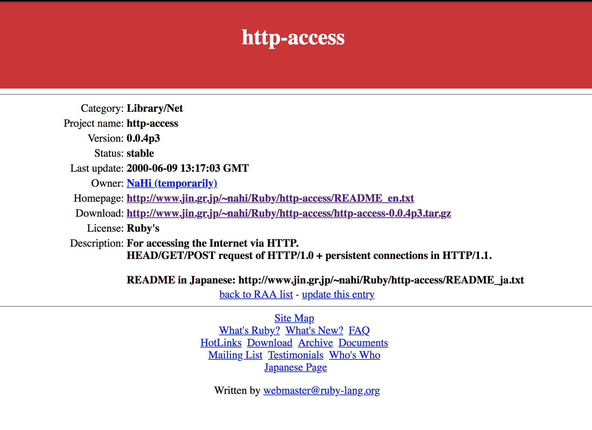

# http-access

> Recovered http-access.rb file

## History

This is the file that's mentioned in `http.rb`

```
grep -r http-access.rb ~/.rubies/ruby-2.4.2/lib/
/Users/max/.rubies/ruby-2.4.2/lib//ruby/2.4.0/net/http.rb:# This file is derived from "http-access.rb".
```



## Links

* [web.archive.org](https://web.archive.org/web/20011114205720/http://www.ruby-lang.org/en/raa-list.rhtml?name=http-access)

